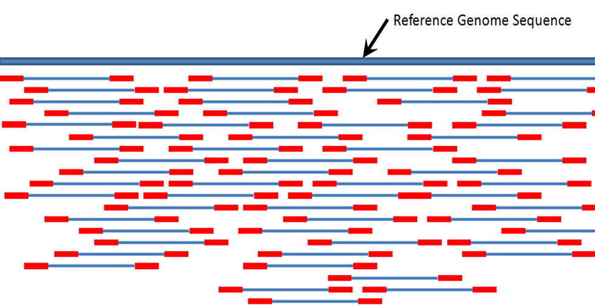
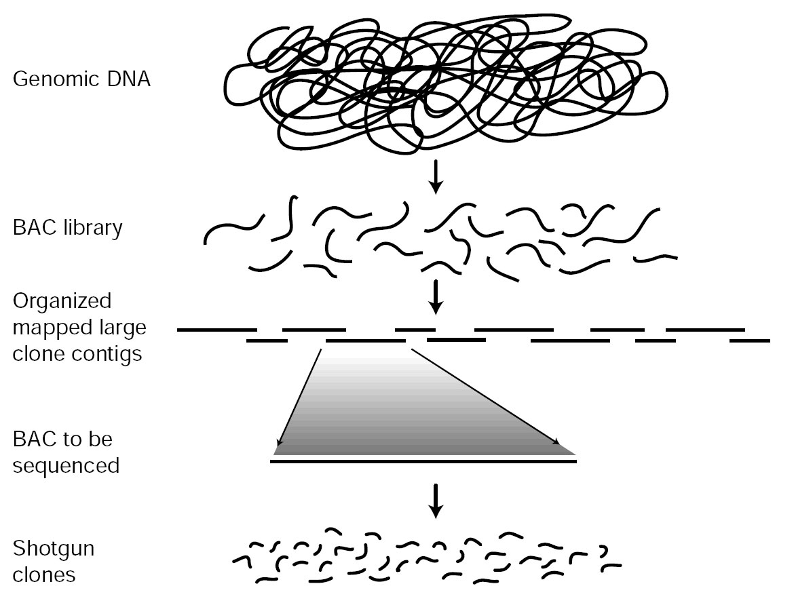
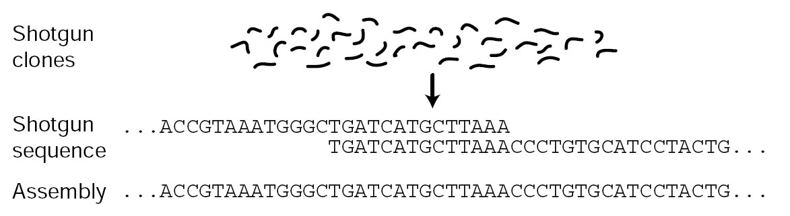

```{r setup, include=FALSE}
knitr::opts_chunk$set(echo = FALSE)
```

# Fifteen years ago from now, a significant<br>breakthrough has achieved in<br>molecular biology and it changed<br>the existing perspective on<br>our researches completely. | Which breakthrough could it be? Any ideas?

## Yes, it's Human Genome Project (HGP).

- Started in 1990 and declared complete in 2003, main objective of the project was determining the DNA sequence of the entire euchromatic human genome.
- Completion of HGP ushered in a new era in medicine.
- **Fun facts:** *20* institutions worked together on the project. It costed *$2.7 billion* and completed more than *two* years ahead of estimated finishing time.

## HGP led to significant advances in the types of technology used to sequence DNA.

- The first sequencing technologies were developed in 1977 by Sanger *et al.* and Maxam *et al.*
- They were the most common sequencing technologies until the emergence of this new era.
- After 2005, with Roche's 454 technology, new sequencing technologies under the name of "Next Generation Sequencing (NGS) Technologies" or "High Throughput Sequencing Technologies" were commercialized.
- Now, we are capable of producing sequences with very high throughput and at much lower cost than the first sequencing technologies.

## Sequencing technologies vary in the length of reads produced. {.read-lengths}

- **Read** is an inferred sequence of base pairs, corresponding to part of a single nucleotide fragment.
- Even the most advanced sequencing technology (PacBio RS II P6 C4) gives a read length of 13.500 base pairs in average.

<div class="image-container">
  
</div>

## Let's take a look at shotgun sequencing. {.look-shotgun}

<div class="image-container">
  
</div>

# What's missing?

## Reads need to be merged into a longer nucleotide sequence in order to reconstruct the original sequence. {.assembly-intro}

- This process is called **sequence assembly**.

<div class="image-container">
  
</div>

## Two different types of sequence assembly are available.

1. **Mapping assembly:** Recreating the genome with reference based alignment and mapping, using prior knowledge.
2. ***de novo* assembly:** Recreating the original genome sequence through
overlapping sequenced reads, with no prior knowledge.

## What are we working on?

- In a 2001 paper, Oppegaard *et al.* transferred a multi-drug resistance plasmid between Coliform bacteria of human and bovine origin.
- Then they've isolated the bacteria from the subjects and seen that they were all *E. coli*, except one human isolate of *Citrobacter freundii*.
- We have whole genome sequences of *E. coli* F5-96 and *C. freundii* F20-96 isolates.
- Sequences contain both chromosomal DNA and the transferred plasmid genome.
- We are trying to distinguish plasmid genomes from chromosomal DNAs and then assemble them to create a plasmid map.

## What have we done so far?

- First of all, we have found the reference genomes for those strains of *E. coli* and *C. freundii* organisms from Nuccore.
- Then we've performed a local alignment between our reads and complete genome using Burrows-Wheeler Aligner, BWA-MEM algorithm which is designed for high-quality queries and for 70-100bp Illumina reads.
- We have seen that 208.980 of 251.128 reads *(83.21%)* in *C. freundii* and 300.816 of 343.434 reads *(87.59%)* in *E. coli* are mapped and paired.
- In both organisms, there exists a total of ~40.000 reads unmapped.

## How to proceed from here?

- Now we have got a FASTQ file of the unmapped reads to compare with reference genomes.
- We will try to assemble those 40.000 unmapped reads with both *de novo* and mapping assembly.

## Acknowledgements

I would like to express my sincere thanks to,

* Assistant Professor Terje Steinum, for sharing his work and data to be processed by us.
* Assistant Professor Andrés Aravena, for his insights, discussions and helps for making this project happen.

## References {.references}

- <sup>1</sup> [Human Genome Project Completion: Frequently Asked Questions](https://www.genome.gov/11006943/human-genome-project-completion-frequently-asked-questions/)
- <sup>2</sup> Chial, H. (2008) DNA sequencing technologies key to the Human Genome Project. Nature Education 1(1):219
- <sup>3</sup> Kchouk M, Gibrat JF, Elloumi M (2017) Generations of Sequencing Technologies: From First to Next Generation. Biol Med (Aligarh) 9: 395. doi:10.4172/0974-8369.1000395
- <sup>4</sup> Chaisson, M.J., Brinza, D. and Pevzner, P.A., 2009. De novo fragment assembly with short mate-paired reads: Does the read length matter?. Genome research, 19(2), pp.336-346.
- <sup>5</sup> Oppegaard, H., Steinum, T.M. and Wasteson, Y., 2001. Horizontal transfer of a multi-drug resistance plasmid between coliform bacteria of human and bovine origin in a farm environment. Applied and environmental microbiology, 67(8), pp.3732-3734.

# Thank you for your time and attention. | Any questions?<br><small>Open source code of this presentation is available on Güney's [GitHub](https://github.com/guney/assembly-of-sequence-reads-presentation).</small>